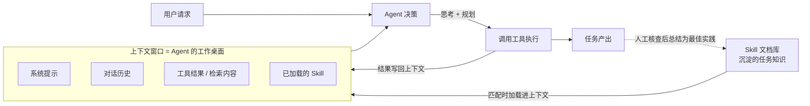

# 概念关系说明：Agent、大模型的上下文与 Skill

> 本文说明本仓库三个核心概念之间的关系：**上下文（Context）如何影响 Agent 的工作**，以及 **Skill 如何沉淀可复用的任务知识**。配合图形版 [concept-relationship.html](concept-relationship.html) 阅读效果更佳。

## 一句话概括三者

| 概念 | 角色 | 一句话定位 |
|---|---|---|
| 大模型的上下文（Context） | **信息基础** | 模型的"工作桌面"——桌面上有什么，模型才知道什么 |
| Agent（智能体） | **执行者** | 大脑（LLM）+ 工具 + 记忆 + 规划，把"会说"变成"会做" |
| Skill（技能） | **知识沉淀** | 写给 AI 的 SOP 手册，把最佳实践变成可复用的资产 |

## 三者的关系

### 1. 上下文是 Agent 的工作内存

Agent 的每一步决策都由 LLM 做出，而 LLM 只能看见上下文窗口之内的信息。因此 Agent 的执行质量直接取决于**上下文管理**：

- **系统提示**决定 Agent 的角色与边界；
- **对话历史**承载任务目标与已完成的步骤；
- **工具调用结果**必须进入上下文，才能支撑下一步决策；
- **记忆机制**本质上就是把"窗口装不下的关键信息"存起来、按需取回。

换句话说：**上下文是 Agent 的约束条件，也是它的操作系统。** 上下文工程的水平，往往比模型大小更能决定一个 Agent 的实际表现。

### 2. Skill 是进入上下文的"预制知识包"

Skill 解决的是另一个问题：同样类型的任务，每次都要在对话里从头解释一遍吗？

Skill 把任务的**触发条件、工作步骤、输出规范、自检清单**写成一个文档（SKILL.md），放在约定目录。当用户请求匹配时，这份文档被**加载进上下文**——用很小的篇幅换取该任务的完整方法论。

所以 Skill 与上下文的关系是：**Skill 是沉淀，上下文是消费。** 技能文档平时安静地待在仓库里，工作时刻被调入上下文发挥作用。

### 3. 三者构成的完整闭环

用文字串起来就是一条循环链路：

1. **Skill 提供方法论**：匹配的技能文档被调入上下文；
2. **上下文支撑决策**：系统提示 + 历史 + 工具结果 + 技能文档，共同构成 Agent 的"所见"；
3. **Agent 执行并反馈**：调用工具，把结果写回上下文，驱动下一步；
4. **产出回流为知识**：人工核查后的好做法，又可以被总结成新的 Skill——沉淀完成，循环增强。

## 容易混淆的点

- **上下文 ≠ 记忆**：记忆是"把信息存下来、以后取回"的机制；上下文只是"当前这次推理能看到的信息"。记忆的价值要通过进入上下文才兑现。
- **Skill ≠ 工具**：工具（Tool）是可执行的动作能力（搜索、写文件）；Skill 是方法论文档，它告诉 Agent *何时、如何*使用工具。
- **Skill ≠ 自动生效**：必须先放进约定目录、且请求与其 description 匹配才会被加载；写了不等于用了，重要产出仍需人工核查。

## 一句话总结

> **上下文决定 Agent "现在知道什么"，Skill 决定 Agent "长期能会什么"**——前者是即时的桌面，后者是沉淀的图书馆。
